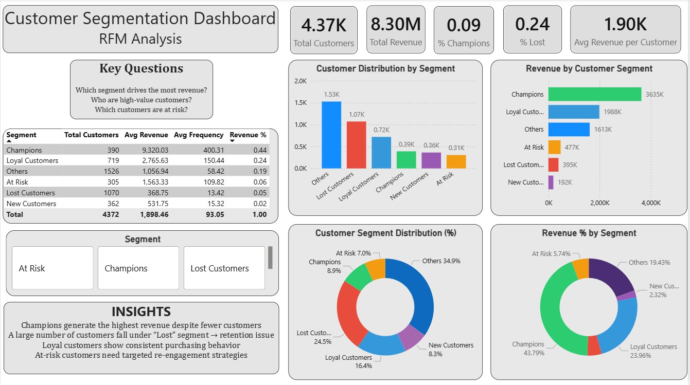

# 📊 Customer Segmentation Using RFM Analysis

End-to-end customer segmentation project using Python and Power BI

---

## 🚀 Project Overview  
This project focuses on segmenting customers based on their purchasing behavior using **RFM (Recency, Frequency, Monetary) analysis**.

The goal is to help businesses identify high-value customers, understand customer behavior, and improve marketing and retention strategies.

The analysis is performed using **Python (Pandas)**, with visualizations for EDA, and final insights are presented through a **Power BI dashboard**.

---

## 🎯 Business Problem  
Businesses often lack clarity on:
- Who their most valuable customers are  
- Which customers are at risk of churn  
- How revenue is distributed across different customer groups  

This project solves this by segmenting customers into actionable categories.

---

## 📂 Dataset  
- Source: Kaggle  
- Type: E-commerce transactional data  

### Key Features:
- CustomerID  
- InvoiceDate  
- Quantity  
- UnitPrice  

---

## 🧹 Data Cleaning & Preprocessing  
- Removed missing and invalid customer records  
- Filtered cancelled transactions  
- Converted date columns to datetime format  
- Created **TotalPrice = Quantity × UnitPrice**  

---

## 📊 Exploratory Data Analysis (EDA)  
Performed analysis using **Pandas, Matplotlib, and Seaborn** to understand:
- Revenue trends  
- Customer purchasing behavior  
- Customer distribution across segments  
- Revenue contribution by each segment  

---

## 🧠 RFM Feature Engineering  
Calculated RFM metrics for each customer:

- **Recency** → Days since last purchase  
- **Frequency** → Number of transactions  
- **Monetary** → Total spending  

---

## 🔢 RFM Scoring  
- Assigned scores based on customer behavior  
- Higher frequency & spending → higher score  
- Lower recency → higher score  

---

## 🧩 Customer Segmentation  
Customers were segmented into:

- **Champions** – High value, frequent buyers  
- **Loyal Customers** – Consistent purchasers  
- **At Risk** – Declining activity  
- **Lost Customers** – No recent activity  
- **New Customers** – Recently acquired  
- **Others** – Moderate behavior  

---

## 📈 Key Insights  
- Champions generate the highest revenue despite fewer customers  
- A large portion of customers fall under the “Lost” segment → retention issue  
- Loyal customers provide stable and consistent revenue  
- At-risk customers require targeted re-engagement strategies  

---

## 📊 Power BI Dashboard  

### Dashboard Highlights:
- Customer distribution by segment  
- Revenue contribution by each segment  
- Key KPIs (Total Customers, Revenue, Avg Revenue per Customer)  
- Segment-wise performance comparison  

---

## 🛠️ Tech Stack  
- Python (Pandas)  
- Jupyter Notebook  
- Power BI  

---

## 🚀 Project Workflow  
1. Data Collection  
2. Data Cleaning  
3. Exploratory Data Analysis  
4. RFM Feature Engineering  
5. Customer Segmentation  
6. Visualization (EDA + Power BI Dashboard)  

---

## 📌 Conclusion  
This project demonstrates how raw transactional data can be transformed into meaningful customer segments and business insights.

It helps businesses:
- Identify high-value customers  
- Improve retention strategies  
- Make data-driven marketing decisions  

 
