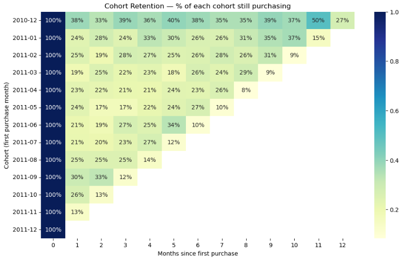
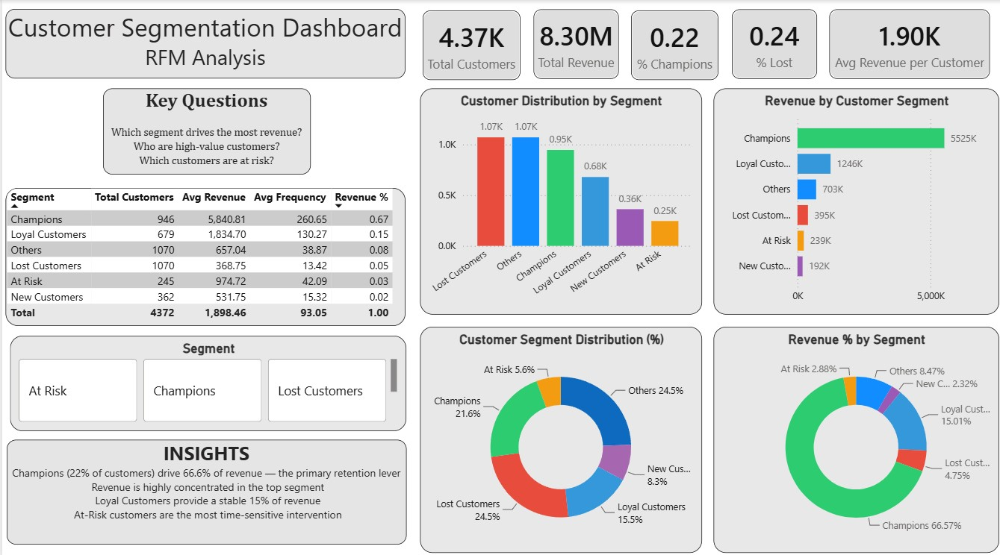

# 📊 Customer Segmentation Using RFM Analysis

End-to-end analysis of **4,372 customers** using **Python, SQL, and Power BI** — 
covering RFM segmentation, cohort retention, and a data-driven action plan. 
Built in pandas, reproduced and validated in SQL.

---

## 🎯 Business Problem
Most businesses can't clearly see who their most valuable customers are, who is 
drifting away, how revenue concentrates, or whether customers stick around after 
their first purchase. This project answers all four using RFM segmentation and 
cohort retention analysis.

---

## 📈 Key Findings
- **Champions are 22% of customers but drive 66.6% of revenue** — revenue is heavily 
  concentrated, making retention of this segment the biggest lever.
- **Retention drops sharply after month 1** — cohort analysis shows most customers 
  never make a second purchase; the ones who do tend to stay loyal.
- **Lost + Others = ~49% of the base but only ~13% of revenue** — a large low-value tail.
- **At-Risk customers hold recoverable revenue** — the most time-sensitive intervention.

---

## 🧩 Customer Segments

| Segment | Customers | % of Base | % of Revenue |
|---|---|---|---|
| Champions | 946 | 21.6% | 66.6% |
| Loyal Customers | 679 | 15.5% | 15.0% |
| Others | 1,070 | 24.5% | 8.5% |
| Lost Customers | 1,070 | 24.5% | 4.8% |
| New Customers | 362 | 8.3% | 2.3% |
| At Risk | 245 | 5.6% | 2.9% |

---

## 📅 Cohort Retention Analysis
Customers were grouped by their first-purchase month and tracked over time to measure 
retention. The key finding: **retention falls from 100% to roughly 25–38% after the 
first month** — most customers don't return for a second purchase, but those who do 
remain loyal for many months. This points to **early churn (the first repeat purchase)** 
as the highest-leverage problem, not acquisition.

---

## 💡 Business Recommendations

| Segment | Action | Metric | Rationale |
|---|---|---|---|
| Champions | VIP program, referral incentives | Retention rate | Drive most revenue — retain, don't extract |
| Loyal | Upsell / cross-sell | Avg order value | Grow spend on a stable base |
| At Risk | Time-sensitive win-back offer | 30-day reactivation rate | Rescuable before they become Lost |
| New | Onboarding + 2nd-purchase incentive | 2nd-purchase rate (30 days) | Attacks the month-1 retention cliff |
| Lost | Low-cost win-back email | Reactivation rate | Large but low-value — don't over-invest |
| Others | Monitor, light engagement | Segment migration | Watch which way they drift |

---

## 🧪 A/B Test Design — At-Risk Win-Back
To validate the At-Risk recommendation, I designed a controlled experiment: randomly 
split At-Risk customers into control (no offer) and treatment (win-back offer), then 
compare **30-day reactivation rates**. If treatment significantly outperforms control 
(p < 0.05), roll the offer out. This demonstrates how the recommendation would be 
validated before a full launch.

---

## 🔁 SQL Validation
The full RFM pipeline was rebuilt in SQL — CTEs for R/F/M calculation, `NTILE(5)` for 
scoring, and a `CASE` statement for segmentation — then validated against the pandas 
implementation. **Segment counts matched within ~1%**, with small boundary differences 
due to how `qcut` and `NTILE` break ties. See [`rfm_segmentation.sql`](rfm_segmentation.sql).

---

## 📊 Power BI Dashboard
Interactive dashboard showing segment distribution, revenue contribution, and key KPIs 
(Total Customers, Total Revenue, Avg Revenue per Customer).

---

## 🛠️ Tech Stack
**Python** (Pandas, NumPy, Matplotlib, Seaborn) · **SQL** (CTEs, Window Functions) · 
**Power BI** · **Jupyter Notebook**

---

## 📂 Repository Files
- `customerSegmentation.ipynb` — full analysis (RFM, cohort retention, recommendations)
- `rfm_segmentation.sql` — SQL reproduction and validation
- `customerSegmentation.pbix` — Power BI dashboard
- `dashboard.jpg` — dashboard preview
- `cohort_retention.png` — cohort retention heatmap

---

## 📌 Data
UCI **Online Retail** dataset — UK e-commerce transactions (Dec 2010 – Dec 2011), 
available on Kaggle.
